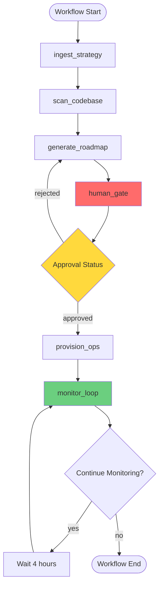

# StateGraph Implementation Plan: Nexus-PM Agent

## 1. AgentState TypedDict Schema

```python
from typing import TypedDict, Optional, List, Dict, Any
from datetime import datetime

class AgentState(TypedDict):
    """
    Immutable state container for the Nexus-PM orchestrator.
    Each node returns a new dict with updated fields.
    """
    # Strategy & Planning
    meeting_audio_path: Optional[str]  # Path to .mp3 meeting file
    strategy_summary: Optional[str]    # Extracted action items from meeting
    
    # Technical Context
    github_context: Optional[Dict[str, Any]]  # File tree, patterns, architecture
    codebase_insights: Optional[str]          # RAG-generated technical summary
    
    # Roadmap & Approval
    roadmap: Optional[str]              # Generated ROADMAP.md content
    roadmap_version: int                # Increments on regeneration
    approval_status: str                # "pending" | "approved" | "rejected"
    approval_token: Optional[str]       # Unique token for resumption
    approval_feedback: Optional[str]    # Lead Dev's change requests
    
    # Linear Integration
    linear_cycle_id: Optional[str]      # Created sprint cycle ID
    linear_issue_ids: List[str]         # Created issue IDs
    provisioning_status: str            # "not_started" | "in_progress" | "complete"
    
    # Monitoring
    monitor_iteration: int              # Tracks cyclic loop count
    last_monitor_time: Optional[datetime]
    blockers_detected: List[Dict[str, Any]]  # Issues with no Git activity
    
    # Metadata
    workflow_id: str                    # Unique workflow instance ID
    started_at: datetime
    last_updated: datetime
```

## 2. Node Function Designs

### Node 1: `ingest_strategy`
**Purpose:** Extract action items from meeting audio using Vertex AI multimodal

**Input State Fields:**
- `meeting_audio_path`

**Output State Fields:**
- `strategy_summary`
- `last_updated`

**Implementation:**
```python
def ingest_strategy(state: AgentState) -> AgentState:
    """
    Pass .mp3 directly to Vertex AI for transcription and action item extraction.
    No preprocessing required - use native multimodal capabilities.
    """
    # 1. Load audio file from state['meeting_audio_path']
    # 2. Create multimodal prompt: "Extract action items and technical decisions"
    # 3. Call ChatVertexAI with audio content
    # 4. Parse response into structured summary
    # 5. Return new state dict with strategy_summary populated
```

**MCP Tools:** `vertex_audio_processor` (speaker diarization)

---

### Node 2: `scan_codebase`
**Purpose:** Build technical context from GitHub repository structure

**Input State Fields:**
- `github_context` (may be None on first run)

**Output State Fields:**
- `github_context`
- `codebase_insights`
- `last_updated`

**Implementation:**
```python
def scan_codebase(state: AgentState) -> AgentState:
    """
    Recursively analyze GitHub file tree to identify:
    - Architectural patterns (monorepo, microservices, etc.)
    - Tech stack (languages, frameworks)
    - Key entry points and dependencies
    """
    # 1. Use GitHub API to fetch repository tree
    # 2. Analyze file structure and extensions
    # 3. Use Vertex AI with 1M token context to generate insights
    # 4. Store both raw context and AI-generated summary
    # 5. Return updated state
```

**MCP Tools:** `github_diff_analyzer` (for context gathering)

---

### Node 3: `generate_roadmap`
**Purpose:** Synthesize strategy + technical context into weekly roadmap

**Input State Fields:**
- `strategy_summary`
- `codebase_insights`
- `approval_feedback` (if regenerating after rejection)
- `roadmap_version`

**Output State Fields:**
- `roadmap`
- `roadmap_version` (increment)
- `approval_status` (set to "pending")
- `approval_token` (generate unique token)
- `last_updated`

**Implementation:**
```python
def generate_roadmap(state: AgentState) -> AgentState:
    """
    Use Vertex AI to create structured ROADMAP.md with:
    - Weekly goals aligned with strategy
    - Technical acceptance criteria
    - Issue breakdown ready for Linear provisioning
    """
    # 1. Construct prompt combining strategy + codebase insights
    # 2. If approval_feedback exists, include it for regeneration
    # 3. Call Vertex AI with structured output format
    # 4. Generate unique approval_token for resumption
    # 5. Increment roadmap_version
    # 6. Return state with roadmap and pending approval
```

**Prompt Template:**
```
Given the following:
- Strategy: {strategy_summary}
- Technical Context: {codebase_insights}
- Feedback (if any): {approval_feedback}

Generate a weekly roadmap with:
1. High-level goals (3-5 items)
2. Technical tasks with acceptance criteria
3. Linear issue format (title, description, labels)
```

---

### Node 4: `human_gate`
**Purpose:** Interrupt workflow for Lead Dev approval

**Input State Fields:**
- `roadmap`
- `approval_token`

**Output State Fields:**
- `approval_status` (updated by external input)
- `approval_feedback` (if rejected)
- `last_updated`

**Implementation:**
```python
def human_gate(state: AgentState) -> AgentState:
    """
    This node does NOT execute logic - it's a checkpoint.
    LangGraph interrupts here via interrupt_before=["human_gate"].
    
    External process (Bob IDE) will:
    1. Display roadmap to Lead Dev
    2. Collect approval/rejection + feedback
    3. Resume workflow with updated state
    """
    # This function may be empty or just log the interrupt
    # State updates happen externally via checkpointer
    return state
```

**Critical:** This node is configured in graph compilation:
```python
graph.add_node("human_gate", human_gate)
# Interrupt BEFORE this node executes
workflow = graph.compile(
    checkpointer=SqliteSaver(...),
    interrupt_before=["human_gate"]
)
```

---

### Node 5: `provision_ops`
**Purpose:** Create Linear issues and sprint cycle from approved roadmap

**Input State Fields:**
- `roadmap`
- `approval_status` (must be "approved")

**Output State Fields:**
- `linear_cycle_id`
- `linear_issue_ids`
- `provisioning_status`
- `last_updated`

**Implementation:**
```python
def provision_ops(state: AgentState) -> AgentState:
    """
    Parse roadmap and create Linear entities via GraphQL:
    1. Create sprint cycle (if not exists)
    2. Create issues with acceptance criteria
    3. Link issues to cycle
    4. Set initial status to "Backlog"
    """
    # 1. Parse roadmap into structured issue data
    # 2. Use linear_graphql_executor to create cycle
    # 3. Batch create issues with GraphQL mutations
    # 4. Store IDs in state for monitoring
    # 5. Return updated state
```

**MCP Tools:** `linear_graphql_executor`

**GraphQL Mutations:**
```graphql
mutation CreateCycle($input: CycleCreateInput!) {
  cycleCreate(input: $input) {
    cycle { id name }
  }
}

mutation CreateIssue($input: IssueCreateInput!) {
  issueCreate(input: $input) {
    issue { id title }
  }
}
```

---

### Node 6: `monitor_loop`
**Purpose:** Detect blockers by comparing GitHub activity vs Linear status

**Input State Fields:**
- `linear_issue_ids`
- `monitor_iteration`
- `last_monitor_time`

**Output State Fields:**
- `blockers_detected`
- `monitor_iteration` (increment)
- `last_monitor_time`
- `last_updated`

**Implementation:**
```python
def monitor_loop(state: AgentState) -> AgentState:
    """
    For each Linear issue in "In Progress":
    1. Query GitHub for commits on associated branch
    2. If no commits in last 4 hours, flag as blocker
    3. Store blocker details for notification
    """
    # 1. Query Linear for issues in "In Progress" status
    # 2. For each issue, extract branch name from description
    # 3. Use GitHub API to check commit history
    # 4. Compare timestamps: last_commit vs current_time
    # 5. If gap > 4 hours, add to blockers_detected
    # 6. Increment monitor_iteration
    # 7. Return updated state
```

**MCP Tools:** 
- `linear_graphql_executor` (query issues)
- `github_diff_analyzer` (check commit activity)

---

## 3. Edge Connections & Workflow Flow



### Edge Definitions

```python
# Linear edges (sequential)
graph.add_edge("ingest_strategy", "scan_codebase")
graph.add_edge("scan_codebase", "generate_roadmap")
graph.add_edge("generate_roadmap", "human_gate")

# Conditional edge after human_gate
graph.add_conditional_edges(
    "human_gate",
    route_approval,  # Routing function
    {
        "approved": "provision_ops",
        "rejected": "generate_roadmap"
    }
)

# Linear edge to monitoring
graph.add_edge("provision_ops", "monitor_loop")

# Cyclic edge for monitoring (self-loop)
graph.add_conditional_edges(
    "monitor_loop",
    should_continue_monitoring,  # Routing function
    {
        "continue": "monitor_loop",  # Self-loop
        "end": END
    }
)
```

---

## 4. Interrupt & Checkpoint Configuration

### SqliteSaver Setup

```python
from langgraph.checkpoint.sqlite import SqliteSaver

# Initialize checkpointer
checkpointer = SqliteSaver.from_conn_string("nexus_pm.db")

# Compile graph with interrupt
workflow = graph.compile(
    checkpointer=checkpointer,
    interrupt_before=["human_gate"]  # Pause before this node
)
```

### State Persistence Flow

1. **Before Interrupt:**
   - Graph executes: `ingest_strategy` → `scan_codebase` → `generate_roadmap`
   - State saved to SQLite after each node
   - Workflow pauses before `human_gate`

2. **During Interrupt:**
   - Bob IDE displays roadmap to Lead Dev
   - Lead Dev provides approval/rejection + feedback
   - External process updates state in SQLite

3. **After Resumption:**
   - Workflow resumes from `human_gate` with updated state
   - Conditional routing based on `approval_status`
   - If rejected: loops back to `generate_roadmap`
   - If approved: proceeds to `provision_ops`

### Resumption Code

```python
# Resume workflow with updated state
config = {"configurable": {"thread_id": workflow_id}}
updated_state = {
    "approval_status": "approved",  # or "rejected"
    "approval_feedback": "Add more detail to task 3"
}

# Resume from checkpoint
for event in workflow.stream(updated_state, config):
    print(event)
```

---

## 5. Conditional Routing Logic

### Router 1: `route_approval`

```python
def route_approval(state: AgentState) -> str:
    """
    Route based on approval status after human_gate.
    """
    if state["approval_status"] == "approved":
        return "approved"
    elif state["approval_status"] == "rejected":
        return "rejected"
    else:
        raise ValueError(f"Invalid approval status: {state['approval_status']}")
```

### Router 2: `should_continue_monitoring`

```python
def should_continue_monitoring(state: AgentState) -> str:
    """
    Determine if monitoring loop should continue.
    Stop after 7 days (42 iterations at 4-hour intervals).
    """
    MAX_ITERATIONS = 42  # 7 days * 6 checks per day
    
    if state["monitor_iteration"] >= MAX_ITERATIONS:
        return "end"
    
    # Check if all issues are closed
    # (Would query Linear here in real implementation)
    all_closed = check_all_issues_closed(state["linear_issue_ids"])
    
    if all_closed:
        return "end"
    
    return "continue"
```

---

## 6. MCP Tool Integration Points

### Tool 1: `vertex_audio_processor`

**Used in:** `ingest_strategy` node

**Purpose:** Speaker diarization for meeting audio

**Input:**
```python
{
    "audio_path": "path/to/meeting.mp3",
    "task": "extract_action_items"
}
```

**Output:**
```python
{
    "speakers": ["Alice", "Bob", "Charlie"],
    "action_items": [
        {"speaker": "Alice", "item": "Implement auth system", "timestamp": "00:05:23"},
        {"speaker": "Bob", "item": "Review PR #123", "timestamp": "00:12:45"}
    ]
}
```

### Tool 2: `github_diff_analyzer`

**Used in:** `scan_codebase` and `monitor_loop` nodes

**Purpose:** Analyze code changes and commit activity

**Input (for scanning):**
```python
{
    "repo": "owner/repo",
    "action": "analyze_structure"
}
```

**Input (for monitoring):**
```python
{
    "repo": "owner/repo",
    "branch": "feature/auth",
    "since": "2024-01-01T00:00:00Z"
}
```

**Output:**
```python
{
    "commits": 5,
    "last_commit_time": "2024-01-15T14:30:00Z",
    "files_changed": ["src/auth.py", "tests/test_auth.py"]
}
```

### Tool 3: `linear_graphql_executor`

**Used in:** `provision_ops` and `monitor_loop` nodes

**Purpose:** Execute GraphQL mutations and queries

**Input (create cycle):**
```python
{
    "query": "mutation CreateCycle($input: CycleCreateInput!) { ... }",
    "variables": {
        "input": {
            "name": "Sprint 2024-W03",
            "startsAt": "2024-01-15",
            "endsAt": "2024-01-22"
        }
    }
}
```

**Input (query issues):**
```python
{
    "query": "query GetIssues($filter: IssueFilter!) { ... }",
    "variables": {
        "filter": {
            "state": {"name": {"eq": "In Progress"}}
        }
    }
}
```

---

## 7. Implementation Roadmap

### Phase 1: Foundation (Week 1)
- [ ] Set up Python project structure
- [ ] Install dependencies: `langgraph`, `langchain-google-vertexai`, `sqlite3`
- [ ] Create `AgentState` TypedDict
- [ ] Initialize SqliteSaver checkpointer
- [ ] Configure Bob mode in `.bob/custom_modes.yaml`

### Phase 2: Core Nodes (Week 2)
- [ ] Implement `ingest_strategy` node
- [ ] Implement `scan_codebase` node
- [ ] Implement `generate_roadmap` node
- [ ] Test nodes individually with mock state

### Phase 3: Human-in-the-Loop (Week 3)
- [ ] Configure `human_gate` interrupt
- [ ] Build Bob IDE integration for approval UI
- [ ] Test state persistence and resumption
- [ ] Implement `route_approval` conditional logic

### Phase 4: Operations (Week 4)
- [ ] Implement `provision_ops` node
- [ ] Integrate Linear GraphQL API
- [ ] Test issue creation and cycle management
- [ ] Handle error cases (API failures, rate limits)

### Phase 5: Monitoring (Week 5)
- [ ] Implement `monitor_loop` node
- [ ] Configure cyclic edge with 4-hour delay
- [ ] Implement `should_continue_monitoring` router
- [ ] Test blocker detection logic

### Phase 6: Integration & Testing (Week 6)
- [ ] End-to-end workflow testing
- [ ] Performance optimization (1M token handling)
- [ ] Error handling and retry logic
- [ ] Documentation and deployment

---

## 8. Critical Design Decisions

### Decision 1: Interrupt Placement
**Choice:** Interrupt BEFORE `human_gate`, not after
**Rationale:** Allows state to be updated externally before node execution

### Decision 2: Cyclic Edge Implementation
**Choice:** Self-loop on `monitor_loop` with conditional routing
**Rationale:** Simpler than separate scheduler node, easier to debug

### Decision 3: State Immutability
**Choice:** Nodes return new dicts, never mutate
**Rationale:** Required by LangGraph, prevents state corruption

### Decision 4: Audio Processing
**Choice:** Direct to Vertex AI, no transcription service
**Rationale:** Fewer dependencies, native multimodal support

### Decision 5: Linear as Source of Truth
**Choice:** GitHub is read-only for analysis
**Rationale:** Linear is operational system, GitHub is technical context

---

## 9. Error Handling Strategy

### Vertex AI Failures
```python
from tenacity import retry, stop_after_attempt, wait_exponential

@retry(stop=stop_after_attempt(3), wait=wait_exponential(multiplier=1, min=4, max=10))
def call_vertex_ai(prompt: str) -> str:
    # Vertex AI call with automatic retry
    pass
```

### Linear API Failures
- Log error and continue workflow
- Store failed operations in state for manual review
- Don't halt entire workflow for single issue creation failure

### GitHub API Failures
- Cache last known state
- Use cached data if API unavailable
- Flag monitoring as "degraded" in state

---

## 10. Testing Strategy

### Unit Tests
- Test each node function with mock state
- Verify state immutability
- Test routing functions with edge cases

### Integration Tests
- Test full workflow with test credentials
- Verify checkpoint persistence and resumption
- Test cyclic monitoring loop termination

### End-to-End Tests
- Real meeting audio → Linear issues
- Approval rejection → roadmap regeneration
- Blocker detection → notification

---

## Next Steps

1. Review this plan with the team
2. Set up development environment
3. Begin Phase 1 implementation
4. Schedule weekly check-ins for progress tracking